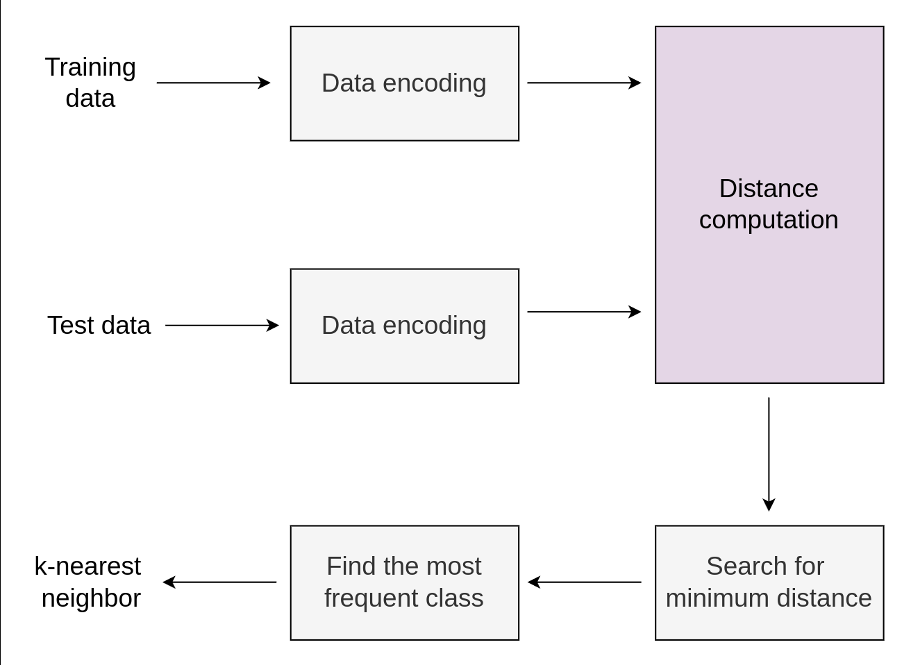

This project implements a quantum K-Nearest Neighbor (KNN) classification algorithm using Qiskit. The KNN algorithm classifies a data point based on the majority class of its k nearest neighbors in the feature space, typically using distance metrics such as Euclidean distance. 
In the quantum version, a quantum circuit is constructed, the dataset is encoded onto quantum states, and the k nearest neighbors are identified based on quantum distance measures. 
K nearest neighbour
